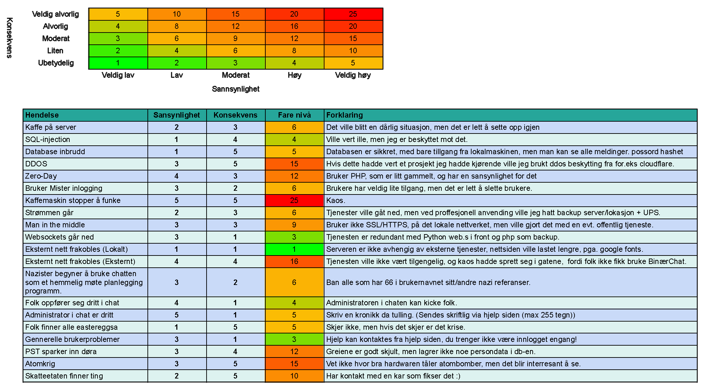

# Terminprosjekt_VG2

## Om prosjektet

Dette er et prosjekt som jeg (Peder) hadde som terminprosjekt i 2021/2022 (VG2).  
Prosjektet baserer seg rundt en chattetjeneste der man kan kan skrive til verandre binært.  
Det er lett inspirert av [**Tom Scott**](https://www.tomscott.com/) og [**Mat Gray**](https://mattg.co.uk/) sin [**Emojli**](https://emoj.li/), der man kan chatte med folk ved bare å bruke emojier.

## Dokumentasjon

### Risikoanalyse

Risikoanalysen er laget i google sheets, og er dynamisk.  
Her er linken [Risikoanalyse](https://docs.google.com/spreadsheets/d/1IDiW37kQBKsodXJcPBkzMjU0js0VPPgknhiSeVK2tZc/edit?usp=sharing)  

Eller en bildekopi her:  


### Netverks diagramm


## Lisenser

- **Inconsolata Font**: [**Lisens (OFL)**](https://scripts.sil.org/cms/scripts/page.php?site_id=nrsi&id=OFL), [**Kilde**](https://fonts.google.com/specimen/Inconsolata?query=inconsolata#about), *Laget av Raph Levien*
- **Python Websockets**: [**Lisens**](https://websockets.readthedocs.io/en/stable/project/license.html), [**Kilde**](https://websockets.readthedocs.io/en/stable/), *Copyright © 2013-2022, Aymeric Augustin and contributors*
- **mysqlclient**: [**Lisens (GPL)**](https://www.gnu.org/licenses/gpl-3.0.en.html), [**Kilde**](https://pypi.org/project/mysqlclient/), *Fork av prosjektet til Andy Dustman*
- **Termcolor**: [**Lisens (MIT)**](https://www.mit.edu/~amini/LICENSE.md), [**Kilde**](https://pypi.org/project/termcolor/), *Laget av Konstantin Lepa*
- **Python**: [**Lisens**](https://docs.python.org/3/license.html), [**Kilde**](https://www.python.org/downloads/), *Copyright ©2001-2022.  Python Software Foundation*
- **XAMPP**: [**Lisens (GPL)**](https://www.gnu.org/licenses/gpl-3.0.en.html), [**Kilde**](https://www.apachefriends.org/index.html), *Copyright (c) 2022, VMware*
- **MySQL**: [**Lisens**](https://www.mysql.com/about/legal/licensing/oem/), [**Kilde (Via XAMPP)**](https://www.apachefriends.org/index.html), *© 2022, Oracle Corporation and/or its affiliates*
- **PHP**: [**Lisens**](https://www.php.net/license/index.php), [**Kilde (Via XAMPP)**](https://www.apachefriends.org/index.html), *Copyright © 2001-2022 The PHP Group*
- **Apache**: [**Lisens**](https://www.apache.org/licenses/LICENSE-2.0), [**Kilde (Via XAMPP)**](https://www.apachefriends.org/index.html), *Copyright © 2022 The Apache Software Foundation*

## Oppsett

### Apache:

- `Apache 2.4.53`

### SQL:

- MySQL/MariaDB
	- Testet på MySQL versjon `8.0.29`
	- Testet på MariaDB versjon `10.4.24`
- Brukeren `binaerio` er laget, og har privlegier
- Oppsett er gjort med `Setup.sql` filen

### PHP:

- Versjon `8.1.5`
- MYSQLI aktivert
- Satt opp med apache
- MySQL Login detaljer i `dblogin.php`

### Python

- Versjon `3.10.4`
- Ekstra pakker:
	- `websockets`
	- `mysqlclient`
	- `termcolor`

Python blir brukt til websockets.

#### Python oppsettkode:

```ps1
pip install websockets mysqlclient termcolor
```
